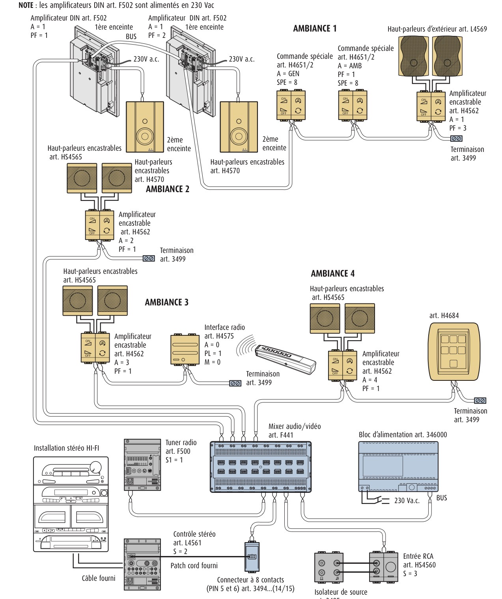

# Sound System / Media Player (`WHO = 16`)

This guide explains how to configure and automate the BTicino / Legrand **Diffusione Sonora** (Sound System) in Home Assistant using the MyHOME integration.

---

## 🎵 Subsystem Architecture

In MyHOME systems, multi-room audio is managed by dedicated hardware analog matrices and room amplifiers communicating over the SCS bus using **OpenWebNet WHO = 16**.

### Supported Hardware
- **Audio Matrix**: F441, F441M (4 stereo source inputs S1–S4, up to 8 independent stereo room amplifier environment outputs over the 2-wire SCS bus)
- **Audio Source Interfaces**: L4561N / L4561 (stereo source interface with RCA line inputs and IR emitter control, 4 DIN modules), L4560 / HS4560 / N4560 / NT4560 / HC4560 (flush-mount modular RCA line-in sockets), 3482 (auxiliary line-in preamplifier / interface), 3495 (source isolator with 1500 Vrms galvanic isolation for ground loop and hum elimination)
- **FM Tuner Modules**: F500, F500COAX (WHO 16 FM RDS stereo tuner modules, 4 DIN modules)
- **Room Amplifiers**: H4562, L4562 (flush-mount stereo room amplifiers), F502 (DIN rail stereo room amplifier, 230 Vac powered), 3484, 3484/1, 3487 (modular stereo/mono amplifiers)
- **Audio Controls & Accessories**: H4651/2, L4651/2 (special controls), HC/HS4563, L/N/NT4563 (rotary controls), HC/HS4653/2, HC/HS4653/3 (soft-touch controls), H/L4684 (colour touchscreen), 3529 (wall control panels), 3499 (bus line terminators), 346000 (SCS bus power supply)

> [!IMPORTANT]
> **Hardware-Only Analog Matrix**: The BTicino F441 / F441M is a purely analog matrix switcher. It does not contain an Ethernet port or digital audio decoder and cannot stream IP audio by itself. It routes line-level analog signals from physical source inputs (Source 1 to Source 4) to its room outputs, one output per **environment**. Amplifiers are addressed `EA` (`01`–`99`): environment digit, then amplifier number within it.

---

## 🧭 How It Fits Together (Start Here)

New to the audio feature? This section answers the foundational questions that come up first: how physical wiring and SCS bus commands work, why you never group your streamer with a room, and how to expose your zones in Music Assistant. The rest of the page goes into deep architectural and protocol details.

### What is connected to what

```
Music Assistant / Home Assistant
        │  1. Play, pause, volume target the ROOM entity: media_player.<room> (e.g. Bathroom)
        ▼
MyHOME Dynamic Proxy
        ├──► OpenWebNet WHO=16 over 2-wire SCS Bus (CONTROL)
        │       ├── Routes matrix environment output to matrix input S1..S4
        │       └── Wakes & powers room amplifier ──► Speakers
        │
        └──► Claims free decoder & sends stream URL over IP
                ▼
        Network Streamer / Decoder (WiiM, Squeezelite, Cambridge Audio, DLNA...)
                │  Analog stereo line out (RCA / 3.5mm jack)
                ▼
        Audio Source Interface (Legrand / BTicino L4561N, 3482, L4560)
                │  2-wire SCS Bus (modulates stereo audio onto the bus)
                ▼
        F441 / F441M Audio Matrix (Source Inputs S1..S4)
                │  2-wire SCS Bus per Environment (carries audio + commands)
                ▼
        Room Amplifiers (H4562, F502, 3484/3487)
                │  Local speaker wires (L / R)
                ▼
        Room Speakers
```

| Part | What it does | Connection |
|---|---|---|
| **Streamer ("decoder")** | Receives the stream from Music Assistant or Home Assistant over IP and converts it into analog line-level audio. | Ethernet / Wi-Fi network in; analog stereo line-level out (RCA / 3.5mm). |
| **Audio source interface (L4561N / 3482 / L4560)** | Accepts line-level stereo analog audio from the streamer and modulates it onto the 2-wire SCS bus to a matrix source input (S1–S4); provides presence signaling on the SCS bus. | Analog line audio in; 2-wire SCS bus connection to matrix source input (S1–S4). |
| **Source isolator (3495)** | Optional galvanic isolator (1500 Vrms) installed between streamer and source interface for Class I or multiple Class II devices to eliminate 50/60 Hz ground loops and hum. | RCA IN from streamer; RCA OUT to source interface. |
| **F441 / F441M matrix** | Switches one of its four 2-wire SCS stereo source inputs (S1–S4) to each room environment output over the 2-wire SCS bus. It has no network audio. | 2-wire SCS inputs (S1–S4) from source interfaces; 2-wire SCS outputs to room environments. |
| **Room amplifiers (H4562, F502, 3484/3487)** | Receives both digital OpenWebNet control frames and modulated stereo audio over the 2-wire SCS bus; powers the room speakers. | Switched on, off and volume-regulated over the 2-wire SCS bus; audio demodulated from the same 2-wire SCS bus; local copper speaker wires (L/R) to speakers. |
| **MyHOME integration** | Ties the three together: wakes the amplifier, routes the room, forwards the stream to a free streamer. | Gateway (SCS bus) and Home Assistant service calls. |

---

<a id="the-2-wire-question-control-vs-audio-stereo-sound"></a>
<a id="the-2-wire-architecture-audio-and-control-over-the-scs-bus"></a>
### The 2-Wire Architecture: Audio & Control Multiplexing & Stereo Sound

A common question is: ***"How can you have stereo sound with only 2 wires, and why do I need an audio interface like the L4561N?"***

- **Audio and commands travel together over the same 2-wire SCS bus.** In BTicino MyHOME **Diffusion Sonore 2 Fils** (2-Wire Sound System), the physical 2-wire SCS bus (white/grey twisted pair) simultaneously carries **27V DC power**, **digital OpenWebNet control frames** (WHO = 16: power, volume, source routing, FM frequency tuning), and **high-frequency modulated stereo audio** across the very same two conductors. There is no separate analog audio cabling running between the matrix and the room amplifiers; the 2-wire SCS bus carries the music directly to each room.
- **Why an audio source interface is required for external streamers.** External network streamers (WiiM, Squeezelite/Raspberry Pi, DLNA DACs, Cambridge Audio, CD players, etc.) output standard baseband analog line-level stereo audio (0.7–2.0 V RMS via RCA or 3.5mm jack). They cannot connect directly to SCS bus screw terminals. A Legrand / BTicino audio source interface—such as the **L4561N / L4561** (4-DIN stereo control module with RCA inputs and IR emitter output), **L4560 / HS4560 / N4560 / NT4560 / HC4560** (modular flush-mount RCA sockets), or **3482** (auxiliary line-in preamplifier)—is the physical bridge that takes line-level stereo analog audio and modulates/injects it directly onto the 2-wire SCS bus into one of the matrix source inputs (S1–S4).
- **Galvanic isolation (art. 3495) for ground loops & hum.** When connecting external Class I audio sources (equipment with an earth ground connection, such as a desktop PC or earthed Hi-Fi amplifier) or multiple Class II sources, BTicino strongly recommends placing a **3495** source isolator between the streamer and the source interface. It provides 1500 Vrms isolation to preserve the SELV safety rating of the MyHOME SCS bus and prevent 50/60 Hz ground hum.
- **Stereo distribution and speaker wiring.** The F441 / F441M matrix and SCS audio bus transmit a true stereo (L/R) signal. Each room environment ("Ambiance") is wired with a single 2-wire SCS bus daisy-chained across room amplifiers (e.g. flush-mount **H4562 / L4562** or DIN rail **F502**) and control panels (**H4651/2**, **H4684**), ending at a **3499** bus termination resistor. The amplifier in the room demodulates the stereo signal and drives the room's speakers over standard local copper speaker wire (Left and Right).

<a id="official-bticino-2-wire-sound-system-wiring-schematic"></a>
#### Official BTicino 2-Wire Sound System Wiring Schematic

The schematic below from the official BTicino MyHOME Diffusion Sonore documentation illustrates how external stereo audio sources, the F441 matrix, and multi-room environment zones all interconnect using the 2-wire SCS bus:


*Figure: Official BTicino MyHOME Diffusion Sonore 2 Fils system architecture and wiring schematic (from catalog 3495). At the bottom: audio sources (F500 RDS tuner, Hi-Fi via L4561 stereo control and 3494 connector, external RCA input via HS4560 and 3495 source isolator) connect to matrix inputs over the 2-wire SCS bus. In the center: F441 matrix and 346000 power supply. At the top: four room environments (Ambiance 1–4) receive 2-wire SCS bus lines driving flush-mount amplifiers (H4562), DIN amplifiers (F502), special controls (H4651/2), and touchscreens (H4684), terminated with 3499 bus line terminators.*

---

### Setting it up, step by step

1. **Cable the hardware:** Connect the analog line output of each streamer into an audio source interface (e.g. L4561N, 3482, or L4560) connected to a free F441/F441M source input (S1–S4).
2. **Add the streamer to Home Assistant:** Use its native integration (for example Squeezelite via Music Assistant's Slimproto provider, WiiM, Cast, or DLNA DMR). It must show up as an active `media_player` entity.
3. **Configure MyHOME Options:** Open **Settings → Devices & Services → MyHOME → Configure**:
   - **Source names** (*Source 1*–*Source 4*): name what is physically wired to each input (e.g. `S1 — WiiM Streamer`) and leave unused inputs blank.
   - **Default source per environment** (optional): set which source a room starts on when switched on.
   - **Decoder rows** (up to 4): map each streamer's `media_player` entity to its matrix input (S1–S4), and set an optional pre-gain offset (e.g. `+15%`). See [Gain Staging](#gain-staging-bus-noise-elimination).
   > [!NOTE]
   > Mapping at least one decoder in this step is what unlocks streaming support (`play_media`) on your MyHOME room entities.
4. **Check the room entities:** Each amplifier zone appears as a `media_player` entity under the MyHOME gateway.
5. **Set up Music Assistant:**
   - Add the **Home Assistant Player Provider** in Music Assistant (**Settings → Providers → Add Provider → Home Assistant**).
   - Under provider settings, select and enable your MyHOME room amplifier entities (`media_player.<room>`).
   - For smooth multi-room listening across the whole house, create a [Sync Group](#recommended-one-music-assistant-sync-group-for-the-house) with **Dynamic members ON**.
6. **Dashboard:** The stock `media-control` and `tile` cards work directly on the room entities. See [Dashboard Display](#dashboard-display-lovelace-speaker-cards) for ready-made cards, including dynamic cards that only display actively playing rooms.

---

### Streamer vs. Room Zone: Never Group the Streamer with a Room

Another frequent question is: ***"My streamer is `Livingroom 1_3519`, but I want to listen in the Bathroom. Should I create a group containing `Livingroom 1_3519` and `Bathroom` so both play?"***

> [!CAUTION]
> **NEVER group your backend streamer with a destination room in Music Assistant or Home Assistant.**

Here is why and how the Dynamic Proxy architecture works:

1. **Understand the distinct roles:**
   - **Backend Streamer / Decoder** (e.g., `media_player.livingroom_1_3519`, WiiM, Squeezelite): This is the physical hardware audio streamer plugged into the matrix input. It is registered in the **MyHOME Decoder Pool** (via **Configure → Decoders**). It serves as an internal audio feeder. You do **not** target it for playback, and you do **not** add it to speaker groups.
   - **Destination Room** (e.g., `media_player.bathroom_sound`): This is the BTicino room amplifier powering the speakers in that room.
2. **How to play music in a room (e.g. Bathroom):**
   - Simply select the **Bathroom** player in Music Assistant (or Home Assistant) and press play!
   - You do **not** touch or select `Livingroom 1_3519`.
   - Behind the scenes, the MyHOME integration automatically:
     - Claims a free streamer (`Livingroom 1_3519`) from the pool.
     - Wakes and powers on the Bathroom amplifier over the SCS bus.
     - Routes the Bathroom environment to Source 1 on the F441/F441M matrix.
     - Streams the audio URL to `Livingroom 1_3519`.
     - Mirrors the track title, artist, album art, and volume back onto `media_player.bathroom_sound`.
3. **What happens if you group the streamer with the room:**
   - Music Assistant attempts to stream simultaneously to both the physical streamer (`Livingroom 1_3519`) and the virtual room proxy (`Bathroom`). This causes duplicated streams, desynchronized playback, queue collisions, or feedback loops.
4. **When do you use groups?**
   - Groups are used **only** when you want to play the same audio across **multiple destination rooms at the same time** (e.g., `Bathroom` + `Kitchen` + `Living Room`).
   - Even in a multi-room group: **only add the MyHOME room entities — never add the backend streamer!**

---

### Exposing MyHOME Rooms in Music Assistant (Home Assistant Player Provider)

If Music Assistant does not list your MyHOME amplifier rooms:

1. **Add the Player Provider:** Music Assistant does not expose Home Assistant media players automatically. In Music Assistant, navigate to **Settings → Providers → Add Provider → Home Assistant (Player Provider)**.
2. **Connect to Home Assistant:** Provide your Home Assistant URL and token (or confirm the auto-discovered connection).
3. **Enable MyHOME Rooms:** Under the player provider settings, select and enable the MyHOME room amplifier entities (`media_player.<room>`) you want to use.
4. **Configure Decoders in MyHOME:** A MyHOME room entity only advertises `play_media` (streaming support) once at least one decoder is mapped in the MyHOME integration options (**Settings → Devices & Services → MyHOME → Configure → Decoders**). If no decoders are configured, the room operates in standalone fallback mode (volume/source only) and Music Assistant will not accept stream commands for it.

---

### Choosing a streamer & Bluetooth considerations

Any network streamer with an analog output works as long as Home Assistant can play a stream URL on it. A wired network connection is the most reliable (such as a Raspberry Pi running Squeezelite/piCorePlayer, WiiM Pro, or Cambridge Audio).

> [!WARNING]
> **Avoid Bluetooth for Streamers**: Attempting to use a Raspberry Pi or other device as an audio source via Bluetooth often leads to choppy audio, dropouts, and stutter. This is caused by RF interference (especially if the device sits near a Wi-Fi router) and Bluetooth audio stack latency. Bluetooth sources are outside what this integration manages. A wired or networked streamer connected to the audio source interface is strongly recommended. See also [Backend Stream Compatibility](#backend-stream-compatibility-dlna-dmr-cambridge-audio-wiim-squeezelite).

---

## 🔀 The Dynamic Proxy Architecture

To bridge modern streaming platforms (such as **Music Assistant**, **Spotify Connect**, or **Squeezelite / LMS**) into the analog BTicino matrix without audio artifacts, the MyHOME integration implements the **Dynamic Proxy** pattern.

```
┌──────────────────────────────────────────────┐
│  Home Assistant / Music Assistant (Player)   │
│  "media_player.living_room_sound"            │
└──────────────────────┬───────────────────────┘
                       │ (Proxy Layer)
                       ▼
         ┌───────────────────────────┐
         │ Decoder Pool Management   │
         │ - Dynamic claim / release │
         │ - Pre-gain (% offset)     │
         │ - State & metadata mirror │
         └─────┬───────────────┬─────┘
               │               │
      [IP Service Call]   [OpenWebNet WHO 16 Control]
               │               │ (Power, Volume, Routing)
               ▼               ▼
       ┌───────────────┐ ┌───────────────┐
       │ Audio Streamer│ │ F441 / F441M  │
       │ (WiiM / Pi /  │ │ Audio Matrix  │
       │  Cambridge)   │ │ & Amplifiers  │
       └───────┬───────┘ └───────▲───────┘
               │ Analog Line-Out │
               ▼                 │ 2-Wire SCS Audio Bus
       ┌───────────────┐         │ (Inputs S1..S4)
       │ Audio Source  ├─────────┘
       │ Interface     │
       │ (L4561N/3482) │
       └───────────────┘
```

### Source switching

Selecting a source sends the same two frames a wall panel puts on the bus:

| Frame | Meaning |
| :--- | :--- |
| `*16*3*10S##` | Activate source device `S` |
| `*16*3*1ES##` | Route environment `E` to source `S` |

The routing address carries the **environment** digit of the amplifier
address, not the amplifier digit. Amplifier addresses are `EA` — environment
followed by amplifier — so zone `23` lives in environment 2 and is routed with
`121` (source 1) or `122` (source 2). The F441M switches per output and an
output serves a whole environment, so **every amplifier in that environment
follows the switch**. Zones 22 and 23 cannot play different sources; that is
matrix hardware, not an integration limitation. The integration holds to it:

- **One stream per environment.** While zone 22 streams from a decoder,
  `play_media` or a source change on zone 23 is refused with an error naming
  zone 22, instead of silently switching zone 22 off its stream.
- **Environment 0 cannot be switched.** Amplifiers `01`–`09` would be routed
  with `10S`, which is the source device address itself. Source selection is
  refused there and no default can be set for it; use a wall panel.
- **Only two-digit amplifier addresses are routed.** The WHO=16 address table
  lists amplifiers as `01`–`99`. A single-digit address such as `1` in a YAML
  configuration does not say which environment it belongs to (`01` or `11`?),
  so it is never routed. Write the address with both digits.

> Earlier releases refused to send these frames, on the assumption that they
> caused relay clicks on MH200-class gateways. Bus captures on an MH200 show
> clean switching. The real problem was a routing address built from the wrong
> digit, which addressed an environment that did not exist.

### Naming your sources

Each F441M input (S1–S4) has a name field in the integration Options. Fill in
what is physically wired to it and **leave the rest blank**.

- Only named sources are offered in the Home Assistant source list.
- A zone routed to a blank input — typically by someone pressing a stale
  button on a wall panel — is labelled `Source N (not configured)` and logged
  once, so amplified silence or tuner hiss has a visible cause.
- Routing chosen at a wall panel is never overridden. The user pressed a
  button in the room, and silently switching it back would be its own
  surprise. Select a configured source to recover.

If no names are configured the legacy `Source 1`–`Source 4` list is used and
nothing is flagged, so existing installations are unaffected.

### Default source per environment

For every environment that has audio zones, the Options offer a **default
source**. It is set per environment, not per zone, because two amplifiers in
one room share a matrix output and cannot sit on different inputs.

- The default is applied when a zone is switched **on from Home Assistant**,
  so a room left on a stale input comes back on the right source.
- It is not applied to a zone that is already on, nor while another zone of
  the environment is streaming.
- It never overrides routing announced by a wall panel.
- *Leave routing as it is* (the default) keeps the existing routing.
- After a Home Assistant restart the bus cannot be asked which input a room is
  on, so the default stands in for it. A room that was on the tuner while the
  default is a decoder that is not playing can therefore switch itself off a
  few seconds after the restart. Turn it back on and it stays on. See
  *Rooms nobody owns follow the music off* below.

Environment 0 is not offered: it has no routing address.

### Routing when streaming

Once sources are named, or a default source is set for an environment,
`play_media` routes the zone's environment to the input its decoder is wired
to, and turning a zone on routes it to its environment default. A zone that is
already on is not re-routed when it is turned on again, and a default is not
applied while another zone in the environment is streaming.

Without either setting the integration does not route while streaming and
relies on the "Hardware Routing First" model below, as earlier releases did.

### Tuner sources (F500 / F500N)

A matrix input can hold a **tuner** rather than a line interface. Tick *Source N
is a tuner* in the options and the integration adds a radio entity for that
input, alongside the amplifier zones.

| Home Assistant | OpenWebNet |
| :--- | :--- |
| On / off | `*16*3*10S##` / `*16*13*10S##` |
| Next / previous track | next / previous station (`*16*6001*10S##` / `*16*6101*10S##`) |
| Source list | stored stations (defaults to 1–5 for F500, dynamically expands up to 1–15 for F500N: `*#16*10S*#7*<N>##`) |
| Seek up / down | `myhome.tuner_seek_up` / `myhome.tuner_seek_down` (`*16*5000*10S##` / `*16*5100*10S##`) |
| `play_media`, content type `channel` | `"1"`–`"15"` selects a station; anything else is read as MHz, so `"107.5"` tunes there |
| `media_title` | RDS text, reported as eight ASCII codes on `DIMENSION 8` |
| `frequency` attribute | `DIMENSION 6`, in MHz |
| `station` attribute | `DIMENSION 7` |

The entity asks the tuner to start reporting RDS (`*16*101*10S##`) when it is
added, although modern tuners broadcast their RDS text autonomously when active.

Two notes on the frames, both from the specification rather than choice: a
station **write** carries its parameter directly (`*#16*101*#7*3##`) while the
**report** prefixes it with a zero (`*#16*101*7*0*3##`), and frequencies are
described as "expressed in Hz" while every example in the same document uses
kHz. The integration follows the examples.

Why declare it instead of detecting it: a source device that has not spoken is
indistinguishable from one that is not there, and a tuner in standby says
nothing at all.

> **Tested on real hardware.** Frequency tuning (`*#16*10S*#6*0*<kHz>##` with leading zero;
> write without zero is ignored), hardware seek up / down (`*16*5000*10S##` / `*16*5100*10S##`),
> station stepping (`*16*6001*10S##` / `*16*6101*10S##`), station selection (`*#16*10S*#7*<N>##`),
> kHz frequency parsing, and autonomous RDS text (`DIMENSION 8`) are hardware-verified
> against a live MH200N + F500N tuner with antenna (contributed by `@manfredgittmaier-afk` on PR #427).

### The "Hardware Routing First" Model

For installations that have not named their sources, `play_media` leaves the
matrix routing to the wall panels.

**Recommended Practice**:

1. **Physical Cabling**: Connect the analog output of your network streamer (e.g. Raspberry Pi running Squeezelite, WiiM Pro, Cambridge Audio) into physical Source 1 on the F441M matrix.
2. **Matrix Configuration**: Configure your room amplifiers (or physical wall panels) to stay routed to Source 1.
3. **Automated Power Sequence**: When a stream starts, the integration proxy:
   - Claims an idle decoder from the shared **Decoder Pool**.
   - Wakes the decoder if it is in standby.
   - Powers the BTicino amplifier on with an OFF → ON sequence (`*16*13*<WHERE>##`, then `*16*3*<WHERE>##`) if it is not already on.
   - Forwards the stream URL to the streaming decoder.
   - Mirrors track metadata (title, artist, album art) and state back onto the Home Assistant room entity.
4. **Shutdown & Release**: When the zone is turned off, the amplifier powers off (`*16*13*<WHERE>##`), playback on the decoder is stopped and the decoder is released back to the idle pool.

---

## 🎛️ Gain Staging & Bus Noise Elimination

Analog SCS audio matrices can suffer from faint ground-loop hum or bus hiss if the input signal level is too low.

The MyHOME integration features **hardware gain staging**:
$$\text{Decoder Volume} = \text{Zone Volume} + \text{Pre-Gain Offset}$$

- Setting `pre_gain` (e.g., `+10%` to `+20%`) drives the network streamer at maximum undistorted line level.
- The room amplifier then operates at lower amplification, pushing the analog noise floor below audibility.

### A volume of 0 is not a mute

Turning a room down to 0, from Music Assistant or a wall panel, leaves it
unmuted: only the mute button mutes. Music Assistant greys out the slider of a
muted player and leaves it out of the group volume, so a room that reports 0
would otherwise be stuck there until you pressed the mute icon. Raising the
volume above 0 (from anywhere) ends a mute. A volume of 0 does not affect the
anti-hiss auto-off, which only follows the decoder: when the stream stops, the
room's amplifier still switches off.

---

## ⚙️ Configuration via Home Assistant UI

Sources, defaults and the Dynamic Proxy are all configured in the integration's **Options Flow**:

1. Go to **Settings** -> **Devices & Services** -> **MyHOME**.
2. Click **Configure**.
3. **Source names** (*Source 1*–*Source 4*): name what is wired to each F441M input and leave unused inputs blank. See [Naming your sources](#naming-your-sources).
4. **Default source for environment N** (one field per environment with audio zones): pick a source, or keep *Leave routing as it is*. See [Default source per environment](#default-source-per-environment).
5. **Decoder mapping**, one row per streaming decoder (up to 4):
   - **Media player entity**: your backend player (e.g. `media_player.squeezelite_salon`).
   - **Source input**: the F441M input it is wired to, chosen from a list that shows your source names (e.g. `S1 — Streamer`).
   - **Pre-gain offset**: percentage added to the decoder volume (0–100 %, e.g. `15`). See [Gain Staging](#gain-staging-bus-noise-elimination).
   - A decoder that is paused from outside (for example a Spotify Connect session started on the device) and not held by one of your zones is left alone by `play_media` for **5 minutes**; after that it counts as free. This applies to the streaming companion of a two-entity decoder as well.
6. Click **Submit**.

Naming a source or setting a default is what switches on automatic routing for
streaming (see [Routing when streaming](#routing-when-streaming)); leaving both
empty keeps the wall-panel routing in charge.

> [!WARNING]
> **Avoid Recursive Loops**: Do NOT select a Music Assistant virtual player as the backend decoder entity. The backend decoder must be the actual hardware device (e.g. `media_player.squeezelite_salon`, `media_player.wiim_dining`), while Music Assistant targets the MyHOME zone entity.

<a id="multi-room-audio-grouping-music-assistant-home-assistant"></a>
<a id="multi-room-audio-grouping-music-assistant--home-assistant"></a>
## 👥 Multi-Room Audio Grouping (Music Assistant & Home Assistant)

The MyHOME integration implements native Home Assistant player grouping (`MediaPlayerEntityFeature.GROUPING`). This enables synchronized multi-room playback across BTicino audio zones without playing separate concurrent audio streams.

### Recommended: one Music Assistant *Sync Group* for the house

When you open a room in Music Assistant and add other rooms to it, that room becomes the group's **leader**. Music Assistant always lists the room you started from as ticked in its group panel, and you cannot untick it. If you untick it while nothing is playing, Music Assistant dissolves the whole group and the other rooms disappear from it. That is Music Assistant's temporary ("ad-hoc") grouping, and MyHOME cannot change it: all that reaches the integration is "remove these rooms".

Instead, create a **Sync Group player** in Music Assistant once and play to that. The group player owns the queue, so no room is fixed, and every room can be ticked and unticked, including the one you used to start from.

1. In Music Assistant open **Settings → Players → Add group player → Sync group**.
2. Name it (for example *Huis*) and add the MyHOME rooms you want to be able to use under **Group members**. These are only the rooms that join when the group starts.
3. Turn **Dynamic members** on and press **Save**. Without it the member list is fixed and no room can be removed.
4. In the player bar at the bottom, open the player selector (bottom right) and pick **Huis**. The group icon now shows *Group members — Huis* and lets you tick and untick every room.
5. Play to **Huis**, not to a room.

Behind the scenes Music Assistant still picks one of the rooms as the *sync leader* and plays the stream to it; MyHOME claims the decoder for that room and routes the other rooms to the same matrix input, as described below. The difference is what happens when that room is unticked:

- **Before you press play**, unticking any room only changes the list. Nothing is sent to the bus.
- **While music plays**, unticking a room that is not the sync leader switches only that room's amplifier off.
- **While music plays**, unticking the sync leader makes Music Assistant re-form the group around the remaining rooms and resume from the same position. This costs the short gap explained in [Why deselecting the group leader gives a short gap](#why-deselecting-the-group-leader-gives-a-short-gap).

### How Grouping Works with the Analog Matrix

When using **Music Assistant (MA)** or Home Assistant's `media_player.join` service:
1. **Single Backend Stream**: Only the group **leader** claims a network decoder from the decoder pool and requests the audio stream (e.g. from Spotify, Tidal, or local FLAC).
2. **Matrix Route Sharing**: Each joined **member** zone routes its physical environment output to the leader's matrix source input (`*16*3*1ES##`) and powers on its room amplifier (`*16*3*<WHERE>##`). Routing follows the same opt-in as the rest of the integration: until you name a source or set an environment default, the wall-panel routing is left alone and only the member amplifiers are switched on. A member only shows the leader's track while it is actually on the leader's input.
3. **Adding to an existing group is additive**: the `group_members` a join call names are added to whoever is already grouped — an existing member is never dropped by joining a new one. Music Assistant's own player calls join this way (only the newly added rooms) and always removes a member with a separate `unjoin`, never by naming a smaller group. **Removing a room is `media_player.unjoin` on that room, and only that**: a `media_player.join` call that names fewer rooms than are grouped (for example a script or a dashboard card sending the full selection it wants) adds the ones that are new and leaves the others in the group.
4. **Cross-Environment & Same-Environment Synchrony**:
   - Zones in different environments (e.g. Environment 2 living room and Environment 3 kitchen) are bridged to the same analog source input, guaranteeing **zero latency** and perfectly aligned analog audio across rooms.
   - Zones within the same environment share the matrix output physically.
5. **Environment Isolation Protection**:
   - The F441 / F441M matrix routes an entire environment to one input. If an attempt is made to join a zone whose environment is already actively streaming from another decoder, the operation is rejected with an `environment_busy` error to prevent cutting off an active listener in that environment. The check runs for every requested member before anything is switched, so a refused join changes nothing. A group that is not playing yet does not block its environments.
6. **A decoder paused by another player is left alone**: a decoder that someone paused from outside (for example a Spotify Connect session started straight on the device) is not handed to `play_media` during the first 5 minutes of that pause; after that it counts as free, so a forgotten pause cannot lock the input for good. A decoder that one of your zones holds is unaffected.
7. **Dynamic Disbanding & Member Lifecycle**:
   - **Leader turns off** (Home Assistant `turn_off`, or OFF at a wall panel) **while rooms are still in its group**: the group is handed to the first remaining member exactly as for `unjoin` (see below). Only the leader's own amplifier is switched off; the decoder keeps streaming and the other rooms keep their routes. The last room of a group turning off still stops the decoder and releases it. **This changes what OFF on the room you started in means**: it used to end the party in every room, now that room leaves and the others keep playing. To stop everything, stop the playback (pause or stop in Music Assistant, or `media_stop` on the leader), or turn off the last remaining room. **Music Assistant will still interrupt the music for a moment when this happens**; see [Why deselecting the leader gives a gap](#why-deselecting-the-group-leader-gives-a-short-gap).
   - **The music stops on its own**: when the leader's decoder goes idle or off, or stays paused, the anti-hiss timer (see below) switches every amplifier of the group off, but the group itself stays as it was, so the group you built in Music Assistant is still there. While parked, the rooms report `paused` (or `idle`) and not `off`, since Music Assistant dissolves a group whose leader is off. Pressing play (or `media_play`, `play_media`, `turn_on`) on the leader wakes the leader and all its members again, routed to the leader's input. Turning the leader of a *parked* group off (from Home Assistant or a wall panel) disbands it, since it is silent already and that is the "I want silence". A *playing* leader turned off hands the group on instead (see below). If another room needs the decoder meanwhile, it takes it and the parked group is dissolved.
   - **Leader calls `unjoin`**: Leadership and the claimed decoder are handed over to the first remaining member atomically, and the old leader's amplifier is powered off. On the bus nothing is interrupted: the new leader and the other members stay on the same matrix input. The player that *Music Assistant* is playing to does change, though, and that costs a short gap (see below).
   - **Member leaves the group**: unjoining removes it from the group at once, but its amplifier keeps playing through a **5-second grace period** rather than being switched off immediately — covering the same room being reassigned elsewhere right after. The same grace period applies when a room joining a group was itself leading a different one: that group's other members are orphaned and get the same treatment. Powering the room off immediately would create an audible gap for no reason. If nothing claims the room again within the grace period (`play_media`, `turn_on`, or being joined into another group), it is switched off exactly as before, just up to 5 seconds later.
   - **Tuner groups are restored too**: a group playing a tuner (F500) has no decoder that could confirm it, so it is restored as soon as its amplifiers report on, not on a decoder's say-so.
   - **Known limit: nothing is sent to the bus at startup**: a member that was moved to another input at a wall panel while Home Assistant was down is restored onto its old leader's decoder, because the bus cannot be asked which input a room is on. The next status report of that room corrects it, and until then the leader's stop switches it off like any other member.
   - **Physical Wall Switch Interaction**: Pressing OFF on a physical wall control sends a bus OFF frame which immediately cleans up group membership in Home Assistant. The OFF → ON wake sequence the integration sends itself is recognised and ignored for 3 seconds; a wall-switch OFF inside that window is corrected by the zone's next status report.
   - **Groups survive a restart or reload**: who holds which decoder and who is grouped with whom is saved after every change and restored when the integration starts, since the amplifiers keep playing through a restart. Nothing is sent to the bus. A restored room only counts once its amplifier has reported on the bus: one that reports off gives its books up, one that reports on takes its decoder (or its place in the group) back, and one that has not reported within 2 minutes (a zone that no longer exists) is dropped, so it cannot hold a decoder for good. A room that was renamed or deleted while Home Assistant was down is dropped at once, without waiting. A decoder you moved to another matrix input in the options while Home Assistant was down comes back unclaimed: the books remember which input it was on, and a claim for a different input is dropped. While a restored room's decoder is not playing, the rules below switch it off like any other room.
   - **Rooms nobody owns follow the music off**: an amplifier that is on plays whatever its environment is routed to, whether or not it is in a group. A room can be on without being in any group in the books (a wall panel can put it on a decoder's input at any time, and groups saved before an outage may be stale). Such a room is switched off when the decoder it hears stops — 3 seconds after it goes idle, standby or off, 60 seconds after it pauses — exactly like the room that owns the decoder, and only if it still hears that decoder when the timer runs out (a room moved to another input, given a decoder of its own, or put to work in a group meanwhile stays on). A decoder that resumes (`playing` or `buffering`) inside that window cancels it, which also covers decoder integrations that report `off` for a moment while they reconnect; `unavailable` and `unknown` are ignored. If the decoder or the delay changes while a timer runs (moved to another decoder's input, paused then stopped), the timer is restarted for the new one. Group members are left to their leader. The input is the one last reported on the bus; the bus cannot be asked for it, so right after a restart the environment's **default source** stands in. Set defaults for the environments you use.

     > **After a Home Assistant restart, a room may switch itself off within a few seconds if it was left on an input other than its environment's default** — for example on the tuner while the default is a decoder that is not playing. Turn it back on (or pick its source again at the wall panel) and it stays on: the bus has then reported its real input.
   - **Rooms found on at startup**: the gateway's startup sweep asks the bus which amplifiers are on (`*#16*0*5##`). Gateway profiles that leave WHO=16 out of that sweep (the MH200's) instead have each zone ask for its own status (`*#16*<zone>*5##`) when it is added, so a restart no longer leaves every room showing off. A room reported on in that first status while its decoder is not playing is switched off the same way; a decoder that is two entities (hardware plus streaming companion) counts as playing if either one plays, and one that does not report yet is decided by its first state change. Rooms you switch on afterwards (from Home Assistant or a wall panel) are left alone until the decoder plays and stops again, so you can turn a room on and then start a Spotify Connect session on the decoder. Rooms on an input no decoder is wired to (a tuner) are never touched. A room the restored groups say owns a decoder is judged by that decoder in the same way.

---


### Why deselecting the group leader gives a short gap

> **In short:** taking the *leader* out of a Music Assistant group (unticking it, turning it off, or pressing OFF on its wall panel) makes the music stop for a moment (a few seconds) and then start again in the remaining rooms, from the same position. This is how Music Assistant moves a queue between players. **It cannot be avoided by MyHOME**; this integration already does everything on its side that can be done.

**What MyHOME does.** The analog bus is independent of the leader's amplifier. A room's sound comes from the matrix input its environment is routed to (`*16*3*1ES##`), not from the leader's amplifier. So when the leader is removed, MyHOME only switches that one room's amplifier off (`*16*13*<WHERE>##`), moves the ownership of the decoder and the group to the first remaining member, and leaves the decoder and every other room's routing untouched. Nothing on the bus is re-sent and the decoder is not stopped.

**What Music Assistant does.** Music Assistant attaches one *queue* to exactly one player, the one it plays to, and the stream URL it hands to the decoder is named after that player's queue. It has no way to move a queue to another player without a break:

1. The player Music Assistant plays to (the leader) goes `off` or is unjoined. Home Assistant's `off`, `standby` and `unavailable` all mean "powered off" to Music Assistant, and a powered-off player cannot own a queue. There is no "off, but still owns the queue" state.
2. Music Assistant *transfers* the queue to another member of the group: it copies the items and the position, **stops** the old queue, loads the new player and resumes. That is a new stream with a new URL.
3. MyHOME receives the new `play_media` on the new leader and plays it on the decoder. A decoder always needs a moment to buffer a new stream, so there is silence in all rooms until that finishes.

Music Assistant itself calls this "accepting a brief audio gap" in its ad-hoc group leader hand-over. Sonos, BluOS and similar systems hide the same transfer inside their own player firmware; a Music Assistant queue that is attached to a Home Assistant entity cannot do that.

**What we considered and why it is not built.** The only way to get a truly gapless hand-over is that the entity Music Assistant owns the queue on **never goes off while any room is listening**, so that it never has to move. That means Music Assistant plays to something that is *not a room*: the decoder itself (Cambridge Audio, PNL Audio, ...), or a MyHOME "decoder session" entity that stands in front of it and is always the first entry of `group_members`. Then any room, including the one you started in, can be unticked without touching the queue. This is possible in principle and was analysed in detail, with these findings:

- Music Assistant only groups entities that advertise the `GROUPING` feature; the decoders' own entities (from other integrations) do not, so it would have to be a new MyHOME entity.
- Some decoders (Cambridge Audio / StreamMagic) do not accept a Music Assistant stream at all (`unsupported_media_type`), so they can never own a Music Assistant queue.
- It adds a second entity per decoder next to the room entities, which is easy to pick by mistake, and it needs a policy for when the last room leaves.

This was judged not worth the extra moving parts; the short gap on leader removal is accepted as the best behaviour available with a room as group leader. What you can do:

- **Use a Sync Group** (see [Recommended: one Music Assistant Sync Group for the house](#recommended-one-music-assistant-sync-group-for-the-house)). Every room, including the one you started from, can then be unticked. The gap remains only when the room that currently is the sync leader is unticked while music plays.
- **With temporary groups, choose the leader deliberately.** The leader is the room you *play to*. Play to a room that stays on (living room, kitchen) and add rooms that come and go (bathroom, bedroom) as members. Removing a *member* never causes a gap: only that room's amplifier goes off (after the 5-second grace period).

Before this hand-over existed, turning the leader off from Home Assistant or a wall panel switched off **every** room of the group and stopped the decoder. Now the other rooms carry on, after the short gap.

## 📡 Backend Stream Compatibility & DLNA DMR (Cambridge Audio, WiiM, Squeezelite)

When using the Dynamic Proxy, Home Assistant sends direct HTTP streaming URLs to the configured backend decoder.

### The Cambridge Audio Dilemma
The native Home Assistant `cambridge_audio` integration (for CXN, CXN V2, Edge NQ, Evo 75/150, MXN10, AXN10) uses the Cambridge StreamMagic API. By design, it only accepts built-in presets, Airable, and internet radio — it **does not accept raw HTTP stream URLs** from Music Assistant or Home Assistant, raising an `unsupported_media_type` exception.

### Solution: Configure via DLNA Digital Media Renderer (DMR)
To stream seamlessly to Cambridge Audio network players:
1. Enable UPnP / DLNA in the Cambridge StreamMagic app settings.
2. In Home Assistant, install the **DLNA Digital Media Renderer** integration. It will automatically discover your Cambridge Audio streamer (e.g. `media_player.cxn_v2_dlna`).
3. In **Settings** -> **Devices & Services** -> **MyHOME** -> **Configure**, map the DLNA DMR entity as your decoder instead of the native `cambridge_audio` entity.

> [!TIP]
> **Streaming companion**: each decoder slot has an optional **Streaming companion** field. Leave it empty and MyHOME looks for the DLNA / UPnP / Cast renderer of the same device, then of the same MAC, then of the same host, then of a device with exactly the same name. If a step finds several different devices (two identical streamers in the rack) MyHOME does not guess: it raises the *Several streaming companions found* repair and keeps that decoder off streams until you pick the entity here. Control and volume always stay on the decoder entity; only stream URLs go to the companion.

> [!NOTE]
> **Automatic Diagnostic & Repair**:
> If you select a `cambridge_audio` entity in MyHOME Options, the integration issues a **Home Assistant Repair Issue** as soon as the options are saved, explaining that DLNA DMR is required and linking to the documentation.
> The `cambridge_audio` decoder stays in the pool: it still provides passive track mirroring and plays presets, Airable and internet radio. A stream URL (Music Assistant, Spotify) skips it and goes to another idle decoder.

---

## 🎧 Passive Source & Metadata Tracking (Streamer-First Workflow)

You do not need to initiate playback through Home Assistant or Music Assistant to see track metadata:
- If you start Spotify Connect, TIDAL Connect, AirPlay, or internet radio directly in the Cambridge StreamMagic or WiiM mobile app, or via a physical matrix source (CD player, tuner):
- Any BTicino zone turned ON and routed to that physical source automatically mirrors track title, artist name, album art, and transport state (`PLAYING`, `PAUSED`).
- Transport controls (`media_play`, `media_pause`, `media_next_track`, `media_previous_track`) operated from the Home Assistant zone card are automatically forwarded to the active source decoder.

---

## 📻 Standalone Fallback Mode (No Decoders)

If you do not configure any streaming decoders in the Options Flow, the room amplifier entities operate in **Native WHO = 16 Mode**:

- **On / Off**: Toggles the physical amplifier power.
- **Volume**: Steps the volume up and down, or sets it directly on the amplifier's 0–31 scale.
- **Source Selection**: Switches the zone's environment between the physical sources (named ones, or `Source 1`–`Source 4` when none are named).

Play, pause, stop and next / previous track are only offered once a decoder is
configured; they are forwarded to that decoder, not sent on the bus.

<a id="dashboard-display-lovelace-speaker-cards"></a>
<a id="-dashboard-display-lovelace-speaker-cards"></a>
## 📊 Dashboard Display (Lovelace Speaker Cards)

You can monitor and control BTicino audio zones using native Home Assistant cards or dynamic community cards.

### Native Home Assistant Cards (Stock UI)

For an out-of-the-box setup without installing third-party cards, use the native `media-control` or `tile` card:

```yaml
# Standard media control card with transport & volume slider
type: media-control
entity: media_player.kitchen_sound
```

```yaml
# Compact modern Tile card with volume and playback controls
type: tile
entity: media_player.kitchen_sound
name: Kitchen Audio
features:
  - type: media-player-volume-slider
  - type: media-player-playback
```

### Dynamic Auto-Collapsing Active Speakers Card

When managing multiple audio zones across a home, displaying inactive amplifiers clutters your main dashboard. This card automatically stays hidden when all sound zones are idle, and dynamically expands to show only the zones currently **playing or active**, with volume sliders, mute buttons, and track controls:

```yaml
# Requires custom:auto-entities (HACS)
type: custom:auto-entities
card:
  type: vertical-stack
  title: 🔊 Active Speakers
card_param: cards
show_empty: false
filter:
  include:
    - integration: myhome
      domain: media_player
      state: '/^(playing|on)$/'
      options:
        type: tile
        icon: mdi:speaker
        state_content:
          - state
          - media_title
          - volume_level
        features_position: bottom
        features:
          - type: media-player-playback
            controls:
              - media_previous_track
              - media_play_pause
              - media_next_track
          - type: media-player-volume-slider
```

> [!TIP]
> **Why tile cards?** Each card is named after its zone (the entity's friendly name), so several playing zones are easy to tell apart. `use_media_info` on the Mushroom media player card replaces the zone name with the track title, so two zones playing the same source look identical. Tile cards and their features are built into Home Assistant, so only `custom:auto-entities` is required. To use your own room names, replace the single `include` entry with one entry per zone (`entity_id: media_player.<zone>`) and add `name:` to its `options`.

> [!TIP]
> **Complete Multi-Room Audio Showcase**:
> For dedicated multi-room audio dashboard views featuring Sections layout, 1-tap source-switching chips (e.g. FM Radio, Streamer), and area all-off master buttons, see [Lovelace Recipes → Recipe 2: Dynamic Multiroom Audio Zone Player](lovelace_recipes.md#recipe-2-dynamic-multiroom-audio-zone-player).

---

## 🩺 Reporting an audio problem

Audio problems usually involve three parties (this integration, Music Assistant
and the decoder), so a report needs two files and one sentence:

1. **MyHOME diagnostics**: *Settings → Devices & services → MyHOME → ⋮ → Download diagnostics*.
   Its `audio` block lists every zone (state, source, volume, mute, whether the
   anti-hiss auto-off has parked it), the decoders (source, pre-gain, state, who
   holds them) and the groups. Rooms appear as `zone_<bus address>` and decoders
   as `decoder_<slot>`, so it carries no room names. The `bus_monitor` block holds
   the last frames on the bus.
2. **Music Assistant log**, only when the problem is on the Music Assistant side
   (group does not form, wrong player, slider locked): *Settings → System → Logs*
   in Music Assistant, around the time it happened.
3. What you did, and when: "21:48, pressed play on the *Huis* group, Bureau's
   slider would not move."

Attach these to the issue instead of pasting log excerpts; two files are enough.

## 📜 OpenWebNet WHO = 16 Reference Frames

`<WHERE>` is an amplifier (`01`–`99`), an environment (`#0`–`#9`) or `0` for
all amplifiers. The integration addresses individual amplifiers.

| Action | OpenWebNet Frame | Description |
| :--- | :--- | :--- |
| **Amplifier ON** | `*16*3*<WHERE>##` | Stereo channel ON. `*16*0*<WHERE>##` is the base-band form. |
| **Amplifier OFF** | `*16*13*<WHERE>##` | Stereo channel OFF. `*16*10*<WHERE>##` is the base-band form. |
| **Volume UP** | `*16*1001*<WHERE>##` | One step up; `1001`–`1015` step +1 to +15. |
| **Volume DOWN** | `*16*1101*<WHERE>##` | One step down; `1101`–`1115` step −1 to −15. |
| **Set Exact Volume** | `*#16*<WHERE>*#1*<LEVEL>##` | Writes the volume, `<LEVEL>` 0–31. |
| **Volume Report** | `*#16*<WHERE>*1*<LEVEL>##` | Amplifier reporting its volume, 0–31. |
| **Activate Source `S`** | `*16*3*10S##` | Switches source device `S` on (`101`–`109`). |
| **Route Environment to Source** | `*16*3*1ES##` | Routes every amplifier of environment `E` to source `S`. Not in `WHO_16.pdf`; established from bus captures on two installations. |

> OWNd 2.0.0b8 and earlier send volume down as `*16*1000*<WHERE>##`, which the
> specification does not define; OWNd 2.0.0b9 sends `*16*1101*<WHERE>##`.

### Checks worth running on a new plant

Grouping, parking and volume are where Music Assistant and the analog matrix meet, so a plant counts as verified once these hold (attach the diagnostics file to the issue, see above):

1. Play to the Music Assistant Sync Group, add a third room, then drop the leader. The matrix and the Music Assistant queue stay in step, and no room falls silent for longer than the leader-handover gap.
2. Set one member of the group to volume 0, then raise it again. The slider does not lock.
3. Let the anti-hiss auto-off silence the house, then press play. The parked members come back as a group.
4. With a Cambridge decoder, the diagnostics show a `companion` that is the DLNA/UPnP renderer, never a `mass` clone.

Use the **Audio field report** issue template so the result can be turned into a replay test.
