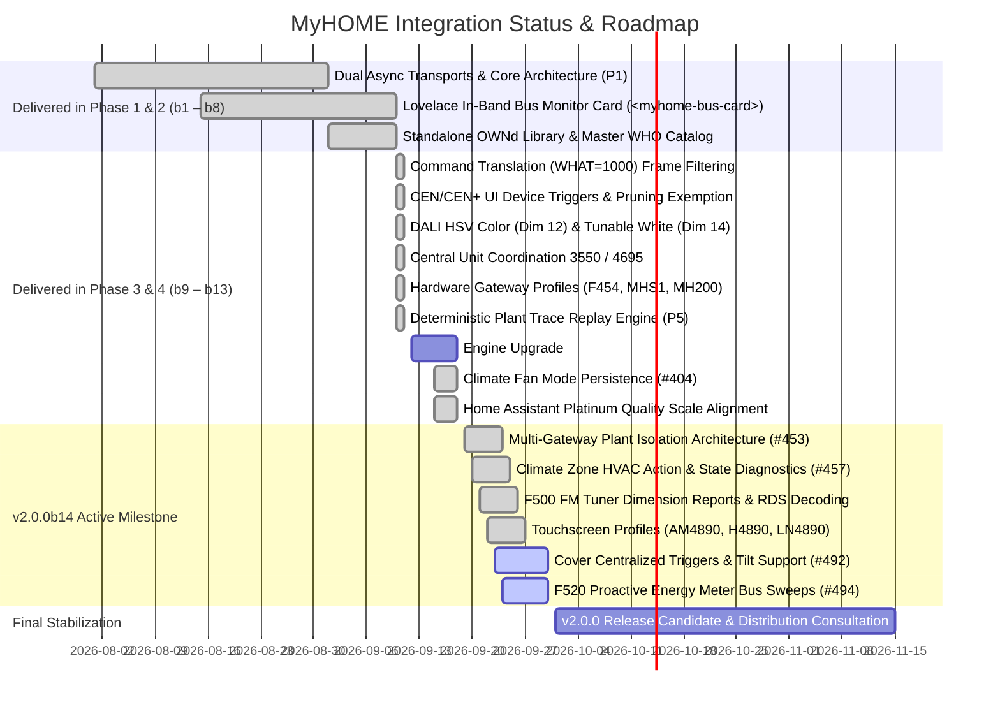

# MyHOME for Home Assistant — Project Roadmap & Architectural Status

Welcome to the development roadmap and architectural status overview for the **MyHOME for Home Assistant** integration.

Our overarching mission is to provide the most reliable, complete, and high-performance integration between Home Assistant and the BTicino / Legrand SCS OpenWebNet ecosystem. We adhere to strict standards: **zero-latency asynchronous architecture**, **hardware-level protocol fidelity**, **100% automated test coverage**, and **full Home Assistant Core 2025/2026 compatibility**.

> [!TIP]
> For release-by-release changelogs, capability matrices, and direct GitHub compare links across all releases, see the companion document:  
> 🔗 [**Beta Evolution, Architectural Milestones & Delta Explorer**](roadmap/beta-differences.md)

---

## 🗺️ Current Delivery Status (v2.0.0 Beta Series & v2.0.0b14 Milestone)

The major architectural milestones originally planned across Phases 1 through 4 have been **consolidated, fully implemented, and validated with 100% statement and branch test coverage** across the **v2.0.0b1 through v2.0.0b13** releases. The active development branch is finalizing the **v2.0.0b14** milestone as part of the v2.0.0 stabilization effort.



---

## 📦 What is Shipped & Operational in the v2.0.0 Series

The following table summarizes the completed architectural features and protocol subsystems verified across the current beta series:

| Priority / Feature | Subsystem | Implementation Status | Highlights |
|---|---|---|---|
| **Standalone Protocol Engine (P1)** | Core | ✅ **Shipped** (`OWNd 2.0.0b8`) | Fully decoupled, strongly typed async engine on PyPI; supports legacy clear-text, numeric, and modern HMAC-SHA1 / HMAC-SHA256 session handshakes. |
| **Multi-Gateway Isolation Architecture** | Core / Routing | ✅ **Shipped** (#453) | Namespaced dispatchers, independent session queues, and cross-gateway bus protection eliminating cross-talk in multi-gateway installations. |
| **CEN / CEN+ UI Device Triggers (P2)** | WHO=15 / 25 | ✅ **Shipped** | Native Home Assistant UI device triggers with preserved 4-digit addressing (`"0001"`), parent gateway isolation, and all 8 press/held/release actions with repeat debouncing. |
| **In-Place Gateway Reconfiguration** | Config / Options | ✅ **Shipped** | Update IP address, password, or hardware model directly through Options Flow without deleting devices or breaking entity IDs. |
| **Dynamic Command Worker Concurrency** | Transports | ✅ **Shipped** | User-configurable (1–4 workers) command concurrency automatically capped to hardware-safe limits per gateway model (e.g. 1 for MH200/MH201, 4 for F454/MHS1). |
| **Native Hardware Bus Timers** | WHO=1 | ✅ **Shipped** | Offloaded countdown timers on Legrand DIN actuators (F411) via `myhome.turn_on_timed` or `duration` parameters in `light.turn_on` / `switch.turn_on`. |
| **Central Unit Coordination (P4)** | WHO=4 | ✅ **Shipped** | Dedicated master coordination for 99-zone Central Unit (`#0`, model 3550) and 4-zone Central Unit (`#0#1`, model 4695). Master Seasonal switches propagate to subordinate zones. |
| **Climate Zone State Diagnostics** | WHO=4 | ✅ **Shipped** (#404, #457) | Dynamic HVAC action deduction (`heating`, `cooling`, `idle`), fan mode persistence across restarts, and startup diagnostic sweeps. |
| **Real-World CI Trace Replay Engine (P5)** | Testing / CI | ✅ **Shipped** | Automated pytest fixture engine (`tests/test_trace_replay.py`) replaying authentic on-wire captures across multiple plants (Nicola Cavallo #247, MH200 physical plant, F454/MH202 captures, F418U2 dimmers). |
| **DALI Tunable White & Color** | WHO=1 | ✅ **Shipped** | DALI DT8 tunable white (Kelvin 2000K–6535K / mireds, Dimension 14), native HSV color promotion (Dimension 12), and smooth dimming speed curves. |
| **Declared Groups & Assumed State** | WHO=1 | ✅ **Shipped** (#368) | Lighting groups with assumed-state inference and automated targeted status sweeps (`broadcast_resync`) upon intercepting group (`WHERE=#1`) or all-off (`WHERE=0`) frames. |
| **Cover Concurrency & Travel Calibration** | WHO=2 | ✅ **Shipped** (#433) | Virtual travel-time positioning, dedicated cover run-stop locks, hardware feedback (Dimension 10), and Lovelace calibration dashboard card. |
| **Sound System 2.0 & Streaming Proxy** | WHO=16 / 22 | ✅ **Shipped** | Multi-room matrix amplifier control (F441/F441M), volume normalization (0–31 scale), F500 FM Tuner RDS decoding, and Dynamic Proxy Decoders for Music Assistant / Spotify. |
| **Energy Management & Metering** | WHO=18 | ✅ **Shipped** (#494) | Instantaneous active power (W), line voltage (V), current (mA), cumulative totalizers, and proactive bus sweeps for F520 DIN meters. |
| **Burglar Alarm** | WHO=5 | ✅ **Shipped** | Partitions, arm away/home, disarm, panic trigger, and zone 0 synchronization for central units (3485/3486). |
| **Dry Contacts & Technical Alarms** | WHO=25 | ✅ **Shipped** | Dynamic discovery, device class suffix stripping (#247), inverted contact states, and event dispatching for Legrand 3477 binary sensors. |
| **Lovelace Bus Monitor Card** | Frontend | ✅ **Shipped** (`<myhome-bus-card>`) | Live scrolling stream, color-coded WHO badges, scoped custom element registry self-healing (#277), syntax injector, and 1-click clipboard export. |

---

## 🏆 Integration Quality Scale (IQS) Alignment

MyHOME is engineered to achieve the **official Home Assistant 🥇 Platinum Quality Seal** ([Home Assistant Integration Quality Scale](https://developers.home-assistant.io/docs/core/integration-quality-scale/)) for potential Core inclusion, ensuring the highest architectural standards regardless of distribution model.

> [!NOTE]
> **Community Consultation on Upstream Core Inclusion vs. Independent Distribution**:  
> While the integration strictly adheres to 100% of Home Assistant Core Platinum standards, the maintainers and community have **not decided** on upstream Core inclusion. As discussed in community channels (see [RFC Discussion #248](https://github.com/orgs/OpenWebNet-HA/discussions/248)), there are important trade-offs:
> - **Benefits of Core inclusion**: Automatic out-of-the-box discovery for new Home Assistant users without requiring HACS; official documentation on `home-assistant.io`.
> - **Drawbacks & Advantages of remaining an independent custom component**:
>   - **Release Agility**: Rapid deployment of bugfixes, firmware quirk workarounds, and new WHO dimension features without waiting for monthly Home Assistant Core release windows.
>   - **Dedicated Diagnostic Frontend**: Continued bundling and rapid iteration of the in-band `<myhome-bus-card>` Lovelace tool and live bus monitors, which are constrained within Core repository guidelines.
>   - **Community Traces & Plant Fixtures**: Fast, unencumbered additions of real-world captures and experimental protocol options.
>
> Feedback from installers and users is actively welcomed in our Discussions.

All 54 quality scale rules are tracked in `custom_components/myhome/quality_scale.yaml` and continuously validated by `scripts/verify_ha_standards.py`:

```mermaid
graph LR
    subgraph Bronze["🥉 Bronze Tier (100% Satisfied)"]
        B1["has_entity_name = True"]
        B2["entry.runtime_data Mapping"]
        B3["async_setup Action Registration"]
        B4["Config Entry Unique IDs"]
    end

    subgraph Silver["🥈 Silver Tier (100% Satisfied)"]
        S1["100.0% Strict Test Coverage"]
        S2["ServiceValidationError Handlers"]
        S3["PARALLEL_UPDATES = 0 Declarations"]
        S4["No Blocking Event Loop Calls"]
    end

    subgraph Gold["🥇 Gold Tier (100% Satisfied)"]
        G1["async_step_reconfigure"]
        G2["strings.json & en.json Translations"]
        G3["icons.json Translatable Icons"]
        G4["Home Assistant Repairs Framework"]
        G5["diagnostics.py Platform"]
    end

    subgraph Platinum["💎 Platinum Tier (100% Satisfied)"]
        P1["Async Client Library (OWNd)"]
        P2["Zero HA Imports in Client Engine"]
        P3["Strict Anti-Drift Sentinels"]
    end

    Bronze --> Silver --> Gold --> Platinum
```



### 📋 Quality Scale Audit Highlights
1. **Bronze Tier**:
   - `has-entity-name`: All entity implementations inherit device names cleanly without manual `self.entity_id` overrides.
   - `runtime-data`: 100% single-source access via `entry.runtime_data` (`MyHomeData` dataclass); zero legacy `hass.data[DOMAIN]` global lookups.
   - `action-setup`: Service actions registered once in `async_setup` and preserved across individual entry reloads.

2. **Silver Tier**:
   - `test-coverage`: Enforced strict 100.0% statement and branch coverage across all integration modules (verified by `tests/test_coverage_enforcer.py`).
   - `parallel-updates`: Explicit `PARALLEL_UPDATES = 0` declared across all 9 platform files to guarantee event-driven thread safety.

3. **Gold Tier**:
   - `reconfiguration-flow`: In-place gateway IP address, port, password, and model corrections supported natively in the UI.
   - `repair-issues`: Built-in repairs platform (`repairs.py`) raising user-actionable diagnostics (e.g. unconfigured gateway timezone sentinel `999`, duplicate address alerts, model conflicts).
   - `diagnostics`: Comprehensive diagnostics export with automatic redaction of passwords and tokens.

4. **Platinum Tier**:
   - `async-dependency`: Zero blocking network calls; standalone asynchronous client engine (`OWNd==2.0.0b8`) on PyPI.
   - `clean-separation`: OWNd engine imports zero Home Assistant symbols and runs independently on Linux/Windows/macOS.

---

## 📊 Real-World Trace Coverage Schematic (What We Have vs. What We Need)

To eliminate regression risks and verify complex timing constraints, our **Trace Replay Engine** (`tests/test_trace_replay.py`) replays authentic on-wire captures against the Home Assistant integration. 

Below is the updated status of real-world captures in CI, and remaining niche plant scenarios where community traces are welcomed:

### 🗺️ System Coverage Overview

```mermaid
graph TD
    subgraph Gateways["🏛️ Gateways & Transports"]
        GW_MHS1["🟢 MyHomeServer1<br/>(Full 70+ dev plant #247)"]
        GW_F454["🟢 F454<br/>(High-speed IP capture #466)"]
        GW_MH200["🟢 MH200 / MH200N<br/>(Physical plant & captures #466)"]
        GW_MH202["🟢 MH202<br/>(Physical plant capture #466)"]
        GW_F461["🟢 F461<br/>(DALI DIN Web Server)"]
        GW_H4890["🟢 H4890 / AM4890<br/>(Touchscreen IP gateway #466)"]
        GW_F455["🟢 F455<br/>(Physical plant capture #466)"]
        GW_3578["🟡 Legrand 3578<br/>(Serial/ZigBee Loopback)"]
    end

    subgraph Subsystems["⚙️ Protocol Subsystems & Scenarios"]
        SUB_LIGHT["🟢 Lighting / Relays (WHO 1)<br/>(4-digit & on/off covered)"]
        SUB_DALI["🟢 DALI DT8 / HSV (WHO 1)<br/>(Dim 12 HSV + Dim 14 TW)"]
        SUB_F418["🟢 F418U2 Dimmers (WHO 1)<br/>(MH200 & F454 captures #501)"]
        SUB_TIMER["🟢 DIN Bus Timers (WHO 1)<br/>(Timed execution covered)"]
        SUB_GRP["🟢 Lighting Groups (WHO 1)<br/>(Assumed state & resync #368)"]
        SUB_COV_V["🟢 Covers Virtual (WHO 2)<br/>(Travel-time positioning #433)"]
        SUB_COV_H["🟢 Covers Hardware (WHO 2)<br/>(Dim 10 status covered)"]
        SUB_CU3550["🟢 Central Unit 3550 (WHO 4)<br/>(99-zone master mode)"]
        SUB_CU4695["🟢 Central Unit 4695 (WHO 4)<br/>(4-zone master mode)"]
        SUB_FANCOIL["🟢 Fancoil Thermostat (WHO 4)<br/>(Dim 11 fan speeds & offsets)"]
        SUB_ENERGY["🟢 Energy Management (WHO 18)<br/>(W, V, mA & F520 sweeps #494)"]
        SUB_DRY["🟢 Dry Contacts (WHO 25)<br/>(Technical alarms & AUX)"]
        SUB_CEN["🟢 CEN / CEN+ (WHO 15/25)<br/>(Triggers & long-press debounce)"]
        SUB_AUDIO["🟢 Multi-Room Audio (WHO 16)<br/>(Matrix routing & F500 tuner)"]
        SUB_ALARM["🟢 Burglar Alarm (WHO 5)<br/>(Partitions & central unit)"]
        SUB_ROUTER["🟢 F422 Bus Router<br/>(Cross-bus #4#02 routing covered)"]
    end

    subgraph Engine["🧪 CI Test Suite"]
        HARNESS["tests/test_trace_replay.py<br/>(100% Deterministic Replay)"]
    end

    GW_MHS1 --> HARNESS
    GW_F454 --> HARNESS
    GW_MH200 --> HARNESS
    GW_MH202 --> HARNESS
    GW_F461 --> HARNESS
    GW_H4890 --> HARNESS
    GW_F455 --> HARNESS
    SUB_LIGHT --> HARNESS
    SUB_DALI --> HARNESS
    SUB_F418 --> HARNESS
    SUB_TIMER --> HARNESS
    SUB_GRP --> HARNESS
    SUB_COV_V --> HARNESS
    SUB_COV_H --> HARNESS
    SUB_CU3550 --> HARNESS
    SUB_CU4695 --> HARNESS
    SUB_FANCOIL --> HARNESS
    SUB_ENERGY --> HARNESS
    SUB_DRY --> HARNESS
    SUB_CEN --> HARNESS
    SUB_AUDIO --> HARNESS
    SUB_ALARM --> HARNESS
    SUB_ROUTER --> HARNESS

    classDef covered fill:#2e7d32,stroke:#1b5e20,color:#ffffff;
    classDef partial fill:#f57f17,stroke:#e65100,color:#ffffff;

    class GW_MHS1,GW_F454,GW_MH200,GW_MH202,GW_F461,GW_H4890,GW_F455,SUB_LIGHT,SUB_DALI,SUB_F418,SUB_TIMER,SUB_GRP,SUB_COV_V,SUB_COV_H,SUB_CU3550,SUB_CU4695,SUB_FANCOIL,SUB_ENERGY,SUB_DRY,SUB_CEN,SUB_AUDIO,SUB_ALARM,SUB_ROUTER covered;
    class GW_3578 partial;
```



---

### 🏛️ Table 1: Gateway Models & Hardware Transports

| Gateway Model | Status | Current Evidence / Fixture | Community Trace Needed / Target Scenario |
|---|---|---|---|
| **MyHomeServer1 (MHS1)** | 🟢 **Covered** | `tests/fixtures/plants/issue_247_nicolacavallo84/` (100 on-wire frames from @nicolacavallo84) | *None needed — full production plant active in CI.* |
| **F454** | 🟢 **Covered** | Nicola Cavallo capture #247 + F454 traces in #466 & #501 | *None needed — high-speed multi-session plant active in CI.* |
| **MH200 / MH200N** | 🟢 **Covered** | `tests/fixtures/plants/mh200_physical_plant/` (107 frames) + issue #466 & #501 traces | *None needed — physical plant with 62 lights, 7 switches, 11 covers active in CI.* |
| **MH202** | 🟢 **Covered** | Real-world plant capture in #466 | *None needed — verified against physical MH202 installation.* |
| **H4890 / AM4890** | 🟢 **Covered** | Livinglight / Axolute 3.5" touchscreen capture in #466 | *None needed — verified against physical display gateway.* |
| **F461 Web Server** | 🟢 **Covered** | Issue #273 capture (@lyubomirtraykov) | *None needed — DALI DT8 ballasts verified.* |
| **F455** | 🟢 **Covered** | Real-world plant capture in #466 (@lionelser) | *None needed — verified against physical F455 basic gateway.* |
| **Legrand 3578 USB/Serial** | 🟡 **Profile Verified** | Loopback transport tests in `tests/test_gateway.py` | **Real-world USB serial stream**: Raw byte capture from physical OpenZigBee installation (`WHERE=<id>#9`). |

---

### ⚙️ Table 2: Subsystems, Dimensions & Edge Scenarios

| Subsystem & Domain | Status | Current Evidence / Fixture | Community Trace Status |
|---|---|---|---|
| **Lighting (WHO = 1) — Relays & Dimmers** | 🟢 **Covered** | F411U2, F418, F418U2 (#501), 4-digit addressing `1000`, `0910`, MH200 plant | *Baseline covered.* |
| **Lighting (WHO = 1) — DALI Tunable White & Color** | 🟢 **Covered** | Dimension 14 (Kelvin 2000K–6535K / mireds) + Dimension 12 HSV color | *Baseline covered.* |
| **Lighting (WHO = 1) — Groups & Broadcasts** | 🟢 **Covered** | Declared groups, assumed-state inference, and automated `broadcast_resync` (#368) | *Resolved in b12/b13.* |
| **Covers (WHO = 2) — Travel-Time & Feedback** | 🟢 **Covered** | Nicola Cavallo capture (`*2*0*42##`, LN4661M2) + Dimension 10 status feedback | *Baseline covered.* |
| **Covers (WHO = 2) — Run-Stop Lock & Centralized Triggers** | 🟢 **Covered** | Dedicated cover lock (#433) + WHO=2 centralized automation triggers (#466) | *Resolved in b14.* |
| **Thermoregulation (WHO = 4) — Central Units** | 🟢 **Covered** | 99-zone Central Unit 3550 (`#0`) + 4-zone Central Unit 4695 (`#0#1`) | *Baseline covered.* |
| **Thermoregulation (WHO = 4) — Fancoils & Actions** | 🟢 **Covered** | Dimension 11 3-speed fancoils, temperature offsets, dynamic HVAC action (#457) | *Baseline covered.* |
| **Sound System (WHO = 16 / 22) — Matrix & Tuner** | 🟢 **Covered** | F441/F441M matrix amplifier control, Dynamic Streaming Proxy, F500 FM Tuner RDS | *Baseline covered.* |
| **Energy Management (WHO = 18)** | 🟢 **Covered** | Active power (W), line voltage (V), current (mA), cumulative energy, F520 sweep (#494) | *Baseline covered.* |
| **Burglar Alarm (WHO = 5)** | 🟢 **Covered** | Partitions, arm away/home, disarm, panic trigger, central units (3485/3486) | *Baseline covered.* |
| **CEN / CEN+ (WHO = 15 / 25) — Dry Contacts & Triggers** | 🟢 **Covered** | F482V12 / 3477 binary sensors, 8-action UI device triggers with long-press repeat debounce | *Baseline covered.* |
| **F422 Cross-Bus Router** | 🟢 **Covered** | MH200 physical plant trace (`tests/fixtures/plants/mh200_physical_plant/`, `#4#02`) | *Baseline covered.* |

---

### 📋 Dual-Track Guide: How Community Testers Can Submit a Trace

We offer **two simple ways** to contribute real-world bus traces, tailored to your technical setup:

#### 🏷️ Track A: Zero-CLI via Home Assistant UI (Fastest & Easiest)
Ideal for standard users running Home Assistant with the MyHOME integration:

1. **Sweep the Bus**: In Home Assistant, go to **Developer Tools** > **Services** and call `myhome.sweep_bus` (or trigger it from the Lovelace Bus Monitor Card). This actively queries all lighting, cover, HVAC, and gateway diagnostic states in under 3 seconds.
2. **Download Diagnostics**: Navigate to **Settings** > **Devices & Services** > **MyHOME** > click the three dots (`⋮`) > **Download diagnostics** (or click **`📋 Export Trace`** on the `<myhome-bus-card>`).
3. **Submit**: Attach the downloaded `.json` file to [**RFC Discussion #248**](https://github.com/orgs/OpenWebNet-HA/discussions/248) or open a GitHub Issue.
4. *Privacy Guarantee*: Home Assistant and MyHOME automatically redact all passwords, authentication tokens, and private credentials before exporting.

#### 💻 Track B: Standalone Python Tool (Test Benches & Integrators)
Ideal for installers, bench testers, and developers testing isolated gateways without Home Assistant installed:

1. **Run the Trace Recorder**:
   ```bash
   python scripts/record_gateway_trace.py --host 192.168.1.35 --password 12345 --model MH202
   ```
2. **Active Sweep & Listen**: The script automatically executes the diagnostic status sweep, listens for ambient button presses or scenario bursts, and scrubs sensitive credentials.
3. **Drop & Commit**: The tool writes a complete ready-to-test fixture folder in `tests/fixtures/plants/<model>_plant/`.
4. **Instant CI Verification**: Run `pytest tests/test_trace_replay.py` — our parameterized test runner automatically discovers and tests your plant with zero additional test code required! Submit a Pull Request.

---

## 💬 Community Links & Resources

Please share your feedback, real-world bus captures, and questions in our community channels:

👉 **[Beta Evolution & Differences Matrix](roadmap/beta-differences.md)** — Side-by-side capabilities across all releases  
👉 **[Join the Community Discussion on RFC #248](https://github.com/orgs/OpenWebNet-HA/discussions/248)**  
👉 **[Report Beta Issues or Submit Bus Traces](https://github.com/OpenWebNet-HA/MyHOME/issues)**
